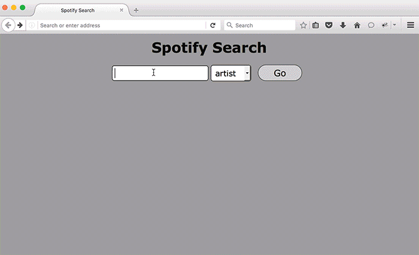

#Portfolio

#Technologies:
  -javaScript
  -jQuery
  -AJAX
  -Node js
  -express
  -fs and express-handlebars modules
  -CSS
  -HTML

#Tasks:
  * connect to Spotify search to search for songs and use scroll event handler to load more results.
  * make a hangman game and connect to the random words Api to get the words.
  * make photos carousel.
  * use methods of the fs module to determine if there is a file in
    the projects directory corresponding to the url property of the request object.
  * use express module to create a server and listen on port 8080.
  * Use the express-handlebars module to create the page that lists and links to all the project in the portfolio.
  * Create a description page for each of your projects and link to them rather than to the projects themselves on your page listing all of your projects. The description page should contain a header and a footer that links back to the project listing. The main content area should show the name of the project, a textual description of the project, and a link to the project itself.

#Spotify

#carousel

